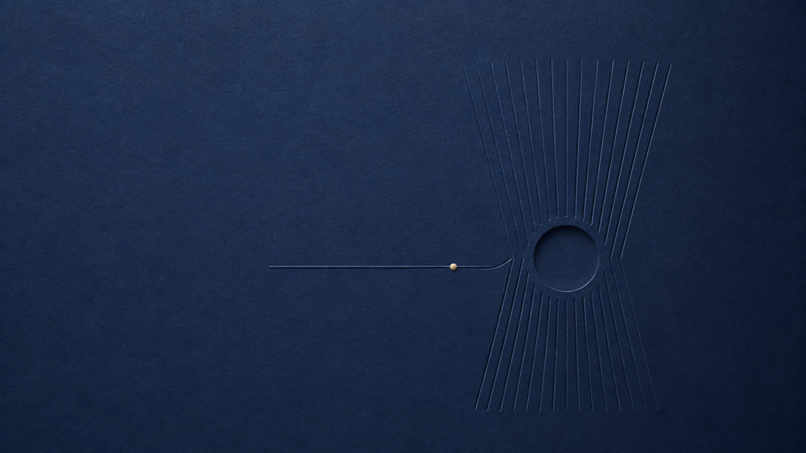
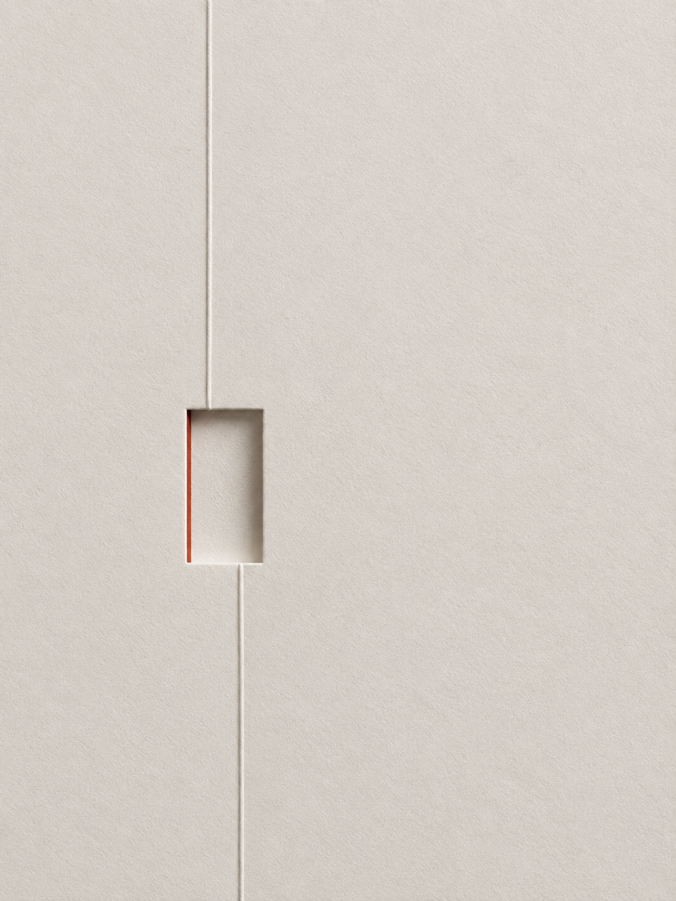

# 俊达·纸面压纹视觉设计 / Junda Paper Emboss Editorial

`$junda-paper-emboss-editorial` 将主题、少量文案和合规参考图，转成原创的纸张压纹编辑视觉：无涂层纸纤维、浅击凸/压凹、统一柔侧光、一个视觉隐喻、克制色彩与大留白。

它适合文章头图、社交媒体封面、书封、品牌视觉、活动海报和无字网站 Hero；不把它做成参考海报复刻器、人物/产品保真转绘器或厚重 3D 特效工具。

## 调用

```text
使用 $junda-paper-emboss-editorial 为“停止证明自己，开始交付”生成 3:4 文章封面；深墨绿与暖白，克制但有力量。
```

通常只需提供主题或标题。可选补充副标题、比例、用途、颜色、品牌限制、禁用元素和参考图。

## GitHub 安装

可用 Codex 内置 Skill Installer 的 Git 方法安装：

```bash
python3 "${CODEX_HOME:-$HOME/.codex}/skills/.system/skill-installer/scripts/install-skill-from-github.py" \
  --repo jjd0324/junda-paper-emboss-editorial \
  --path skills/junda-paper-emboss-editorial \
  --method git
```

安装目标是 `$CODEX_HOME/skills/junda-paper-emboss-editorial`；新 Skill 会在下一轮对话可用。

## 参考图怎么用

参考图有明确的三条路线：

| 角色 | 用途 | 是否直传生成器 |
| --- | --- | --- |
| `style-only` | 提炼纸材、压纹、侧光、色温和信息密度 | 默认只分析；仅用户自有/获授权的无主体风格图可受控直传 |
| `composition-only` | 提炼至多两个粗粒度空间规则 | 不直传，先抽象成 3×3/文字布局规则 |
| `subject-photo` | 需要保留人物、宠物、产品或地标 | 不属于本 Skill，转到参考图保真流程 |

未标注角色的外部图片或链接，默认按 `style-only + analyze-only`：可以分析设计语言，但不会直接传图或复刻内容。完整规则见 [参考图工作流](skills/junda-paper-emboss-editorial/references/reference-image-workflow.md)。

### 上传参考图：复制即用

用户可以在调用时直接附图。若希望图片真正参与生成，请明确“这是我自有/获授权的风格参考”、想保留什么、想改成什么；默认只迁移纸材、浅压纹、侧光、色温与视觉密度，而不是复刻原图。

```text
使用 $junda-paper-emboss-editorial。
这张图是我自有/获授权的风格参考；仅保留纸材、浅压纹与侧光，
不要保留人物、文字、Logo、对象或具体构图。
为“{主题}”生成一张 {比例} 的原创纸面压纹视觉设计。
```

## 文字精度

短标题且用户接受近似时，可以直接生成。文章标题、品牌名、日期、数据和长中文默认先做无字艺术底图，再以 SVG、Figma、Canva 或已有工具叠加精确文字层；这样不会把模型的近似文字误报为排版成品。默认 `3:4` 可直接从 [可编辑 SVG 文字层模板](skills/junda-paper-emboss-editorial/assets/editable-text-overlay-3x4.svg) 开始。

## 预览

| 短标题压凹海报 | 无字 Hero 底图 | 合规风格参考生成 |
| --- | --- | --- |
|  |  |  |

第三张预览用项目自有、无主体的第二张预览作为 `style-only + direct-conditioned` 参考，仅保留纸材与浅压纹语言；主题、隐喻、比例、布局和配色均重新设计。所有预览为本项目新生成的概念图，用于验证材质、光向、留白和工艺关系；不代表可直接印刷或生产的工艺文件。项目不提交用户参考图、私人生成结果或第三方样图。

## 项目结构

```text
skills/junda-paper-emboss-editorial/
├── SKILL.md                         # 路由、输入、生成与验收
├── agents/openai.yaml               # Codex 调用入口
├── references/
│   ├── design-system.md             # 版式、纸材、工艺和色彩职责
│   ├── prompt-blueprint.md          # 生成规格模板
│   ├── reference-image-workflow.md  # 参考图契约与原创性门槛
│   └── strict-text-mode.md          # 精确文字层
└── assets/template-previews/        # 通用概念预览与 manifest
```

## 质量与开发

```bash
python3 scripts/validate_project.py
python3 -m unittest discover -s tests -v
```

校验会检查技能元数据、引用文件、Markdown 链接、预览 manifest、PNG 基本结构、公开行为样例和意外敏感标记。GitHub Actions 在 push 和 pull request 上重复运行。

代码、文档和模板采用 [MIT License](LICENSE)；项目内通用预览图采用 [CC BY 4.0](ASSETS-LICENSE)。
